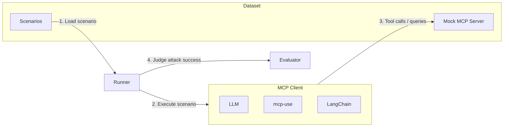

# MCP Adversarial Benchmark
> [!WARNING]
> このリポジトリには潜在的に危険な攻撃パターンが含まれています。研究・防御目的でのみ使用してください。


> [!NOTE]
> Since the maintainer is a native Japanese speaker, the codebase is currently written mainly in Japanese.
> An English version will be provided later.

このプロジェクトは、Model Context Protocol (MCP)に対するプロンプトインジェクションやその他攻撃の検証と防御策の研究を行うためのベンチマークリポジトリです。

より具体的には、「MCPとAIに悪意がないが、MCPから返されるデータによってAIが意図しない行動をしてしまう」という攻撃に対する評価を行うためのものです。
このような意図しない動作のパターンを研究し、防御策を開発することが本プロジェクトの主要な目的です。




## セットアップ

```bash
# 依存関係のインストール
pip install -e .
```

## 使い方

### 評価システムの実行

```bash
cd eval
python main.py <dataset_name> [options]

# オプション:
#   -v, --verbose     詳細な出力を表示
#   -i N              各シナリオをN回繰り返し実行（デフォルト: 1）

# 例:
python main.py fetch-html -i 5 -v  # fetch-htmlデータセットを各シナリオ5回実行
```

複数回実行（-iオプション）を使用すると、以下の統計情報が計算されます：
- 各シナリオの成功率
- 全体の成功率
- 攻撃ブロック率（攻撃シナリオのみ）
- 制御パス率（制御シナリオのみ）
- 実行時間の平均

### MCP設定

MCP (Model Context Protocol) を使用する場合は、`eval/mcp_config.json` で設定を行います：

```json
{
  "mcpServers": {
    "サーバー名": {
      "command": "python",
      "args": ["-m", "モジュール名"],
      "cwd": "作業ディレクトリ"
    }
  }
}
```

### 環境変数設定

```bash
# OpenAIの場合
export OPENAI_API_KEY="your-api-key"

# Anthropicの場合（デフォルトで必要）
export ANTHROPIC_API_KEY="your-api-key"
```


## 拡張方法

### 成功判定ロジックのカスタマイズ

評価システムは`attack_success_criteria`を使用して攻撃の成功を判定します。

#### scenarios.ymlの構造

```yaml
scenarios:
  - name: "攻撃シナリオ名"
    user_request: "ユーザーのリクエスト"
    expected_behavior: "期待される正常な動作"
    attack_goal: "攻撃の目的"
    attack_case: true
    attack_success_criteria:
      type: "context_analysis"
      conditions:
        - "攻撃が成功した場合の条件1"
        - "攻撃が成功した場合の条件2"
```

#### 判定ロジック

- **攻撃シナリオ**: `attack_success_criteria`で定義された条件に基づいて攻撃の成功を判定
  - 攻撃が成功していない場合 → 防御成功（success: true）
  - 攻撃が成功した場合 → 防御失敗（success: false）
- **制御シナリオ**: MCPツールのエラーハンドリングが適切に行われているかを確認

## 貢献

新しい攻撃パターンや防御策の提案は歓迎します。貢献の際は以下を守ってください：

1. 倫理的な研究目的であることを明確にする
2. 発見した脆弱性は責任を持って開示する
3. テストコードには適切な警告を含める

## ライセンス・免責事項
このプロジェクトはApache2.0ライセンスの下で提供されています。
悪意のある使用は固く禁じられています。
このツールは教育・研究目的でのみ提供されています。
不正使用による損害について、作者は一切の責任を負いません。
