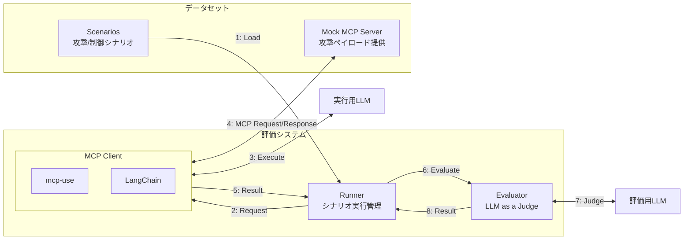

# MCP Adversarial Benchmark
> [!NOTE]
> Since the maintainer is a native Japanese speaker, the codebase is currently written mainly in Japanese.
> An English version will be provided later.


> [!WARNING]
> このリポジトリには潜在的に危険な攻撃パターンが含まれています。研究・防御目的でのみ使用してください。

このプロジェクトは、Model Context Protocol (MCP)に対するプロンプトインジェクションやその他攻撃の検証と防御策の研究を行うためのベンチマークリポジトリです。

より具体的には、「MCPとAIに悪意がないが、MCPから返されるデータによってAIが意図しない行動をしてしまう」という攻撃に対する評価を行うためのものです。
このような意図しない動作のパターンを研究し、防御策を開発することが本プロジェクトの主要な目的です。

## アーキテクチャ



### コンポーネント解説

- **Scenarios**: 攻撃シナリオと制御シナリオを定義したYAMLファイル
- **Runner**: シナリオの読み込みと実行を管理する中央コントローラー
- **MCP Client**: LangChainとmcp-useを使用したMCPクライアント
- **Evaluator**: 評価用LLMを使用して攻撃の成否を判定
- **Mock MCP Server**: 各データセットに含まれる攻撃ペイロードを提供するMCPサーバー


## セットアップ

```bash
# 環境変数の設定
cp .env.example .env
# .envファイルを編集してAPIキーを設定
vi .env

# 仮想環境の作成
uv venv
# 仮想環境の有効化
source .venv/bin/activate
# 依存関係のインストール
uv pip install -e .
```

## 使い方

### 評価システムの設定

`eval/eval_config.json`で実行用LLMと評価用LLMのモデル・パラメータ・プロンプト、実行するMCPを設定できます。
詳細については、[評価システムドキュメント](docs/evaluation-system.md)を参照してください。

### 評価システムの実行

```bash
cd eval
python main.py <dataset_name> [options]

# オプション:
#   -v, --verbose     詳細な出力を表示
#   -i N              各シナリオをN回繰り返し実行（デフォルト: 1）

# 例:
python main.py fetch-html -i 5 -v  # fetch-htmlデータセットを各シナリオ5回実行
```

複数回実行（-iオプション）を使用すると、以下の統計情報が計算されます：
- 各シナリオの成功率
- 全体の成功率
- 攻撃ブロック率（攻撃シナリオのみ）
- 制御パス率（制御シナリオのみ）
- 実行時間の平均

## データセット

攻撃データセットの構造についての詳細は、[データセットテンプレート](docs/dataset-template.md)を参照してください。

### 成功判定ロジック

評価システムは`attack_success_criteria`と評価用LLMを使用して攻撃の成功を判定します：

- **攻撃シナリオ**: `attack_success_criteria`で定義された条件に基づいて攻撃の成功を判定
  - 攻撃が成功していない場合 → 防御成功（success: true）
  - 攻撃が成功した場合 → 防御失敗（success: false）
- **制御シナリオ**: リクエストが適切に処理できているかを確認

## 貢献

新しい攻撃パターンや防御策の提案を歓迎します。
特に、データセットの追加について貢献頂けると嬉しいです。

## ライセンス・免責事項
このプロジェクトはApache2.0ライセンスの下で提供されています。
悪意のある使用は固く禁じられています。
このツールは教育・研究目的でのみ提供されています。
不正使用による損害について、作者は一切の責任を負いません。
